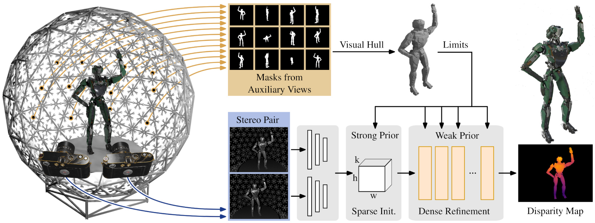

# VHS: High-Resolution Iterative Stereo Matching with Visual Hull Priors



Official implementation of
> __VHS: High-Resolution Iterative Stereo Matching with Visual Hull Priors__  
> Markus Plack, Hannah Dröge, Leif Van Holland, Matthias B. Hullin  
> _arXiv preprint arXiv:2406.02552, 2024_  
> __[Paper](https://arxiv.org/abs/2406.02552)__  

Code will follow soon.

## Citation

```bibtex
@article{plack2024vhs,
  title={VHS: High-Resolution Iterative Stereo Matching with Visual Hull Priors},
  author={Plack, Markus and Dr{\"o}ge, Hannah and Van Holland, Leif and Hullin, Matthias B},
  journal={arXiv preprint arXiv:2406.02552},
  year={2024}
}
```
